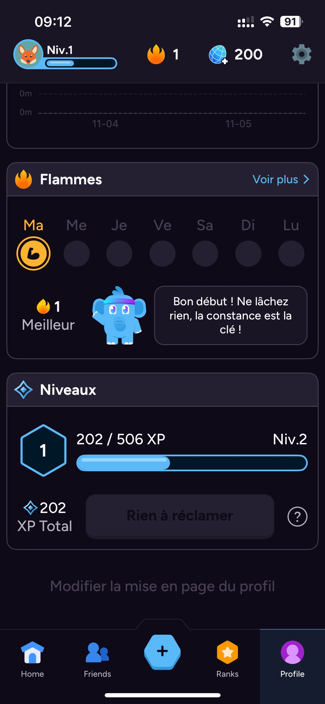
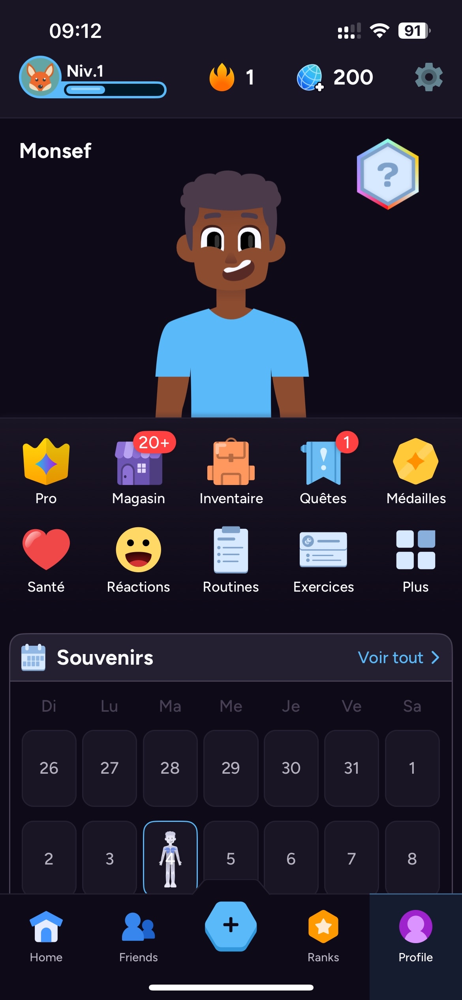
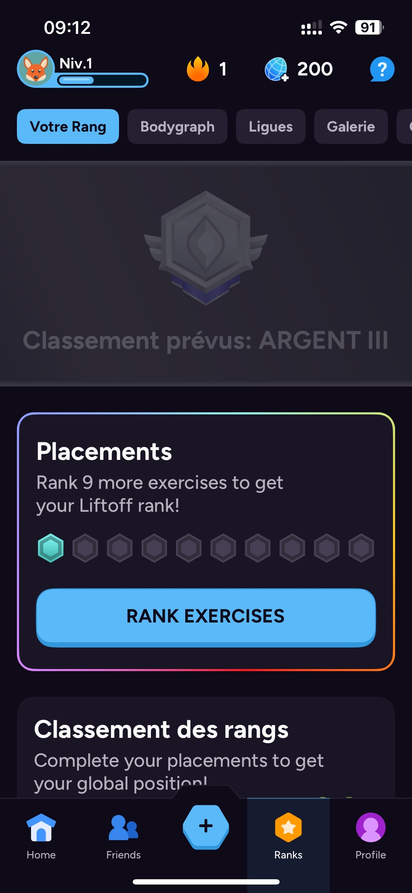

# GymRank — Analyse & Conception

## Analyse et Conception

Le plus dur au gym, ce n’est pas l’exercice… c’est **tenir la routine**. Manque de structure, pas de feedback immédiat, et zéro reconnaissance des efforts : la motivation chute.

**GymRank** est une app de **plan d’entraînement** avec un système de **rangs** (Bronze → Challenger) et de **points** pour récompenser la régularité, le volume d’entraînement et les objectifs atteints. L’utilisateur suit un plan adapté (force, hypertrophie, perte de gras, remise en forme), enregistre ses séries/reps/charges et **grimpe de rang** en maintenant ses streaks.

---

## Rapport

### 1) Problématique
- Les gens **abandonnent** faute de structure claire (quoi faire aujourd’hui ? combien de séries ? quand déload ?).
- Les apps actuelles **journalisent** bien mais **motivent** peu (pas de progression lisible, peu de milestones).
- La **progression** (surplus de charge, RPE, volume hebdo) est mal comprise → stagnation ou blessure.
- Manque d’**objectifs concrets** et de **rétroaction** (rangs, badges, challenges) pour entretenir l’engagement.

### 2) Description de la solution
- **Plan intelligent** : choix d’un objectif (force, hypertrophie, perte de gras, cardio mixte) → génération d’un **plan périodé** (blocs/semaine, split, progression).
- **Séance guidée** : pour chaque séance, l’app affiche **exercices, séries, reps, tempo, repos** + minuteur intégré.  
- **Log ultra-rapide** : entrée des séries (poids × reps, RPE/tempo optionnels), suggestions de la **charge suivante** selon l’historique.
- **Rangs & Points** : points basés sur **volume**, **intensité**, **streak**, **respect du plan**. Paliers de rangs avec **conditions** (ex. 4 semaines consécutives ≥ 80% du plan).
- **Badges & Challenges** : défis hebdo/mensuels (ex. “5 séances/7j”, “5 000 kg soulevés/semaine”).
- **Progression visuelle** : courbes de charge 1RM estimée, volume par groupe musculaire, temps sous tension, PRs.

### 3) Valeur ajoutée
- **Motivation mesurable** : un système de **rangs** clair, méritocratique, qui valorise la **constance** autant que la performance.
- **Guidage concret** : plans **clé-en-main** avec logique de progression et **déload** automatiques.
- **Feedback utile** : analytics orientés **action** (quoi augmenter, quand alléger).
- **Friction minimale** : log en 2 taps, templates de séances, auto-suggestion de la charge prochaine.

### 4) répartition des tache
- ux
( home monsef, rank will,setting,will)
----
- ui (monsef)
- base de donner (will)
- rank
- finition
- pas vu en classe (clendrier de perfectmence)

### 6) Barème de points & progression de rang (V1)
- **Base** : 1 point par **set complété** (non échauffement).  
- **Volume** : +1 point / 500 kg (ou 1100 lb) de **tonnage** par séance.  
- **Streak** : +2 points par jour si **3+ jours consécutifs** ; +4 si **7+ jours**.  
- **Plan** : +5 points si **≥ 80%** des exos cibles complétés dans la semaine.  
- **PR** : +10 points pour un **PR** validé.  
- **Rangs** (exemple) :  
  - Bronze: 0–299 pts  
  - Silver: 300–799 (≥2 semaines à ≥80%)  
  - Gold: 800–1599 (≥3 semaines, streak 7j)  
  - Platinum: 1600–2999 (≥4 semaines, 1 PR/semaine)  
  - Diamond: 3000–4999  
  - Challenger: 5000+

### 7) Storyboard (Résumé)

